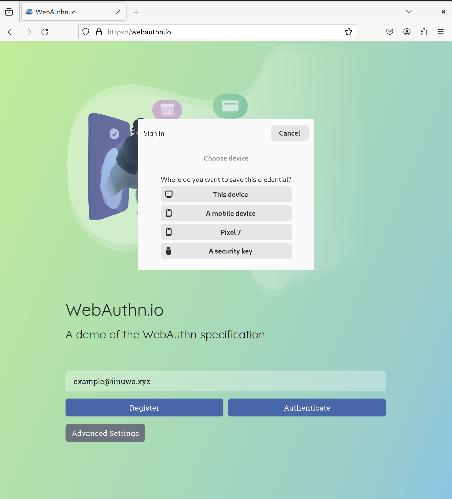
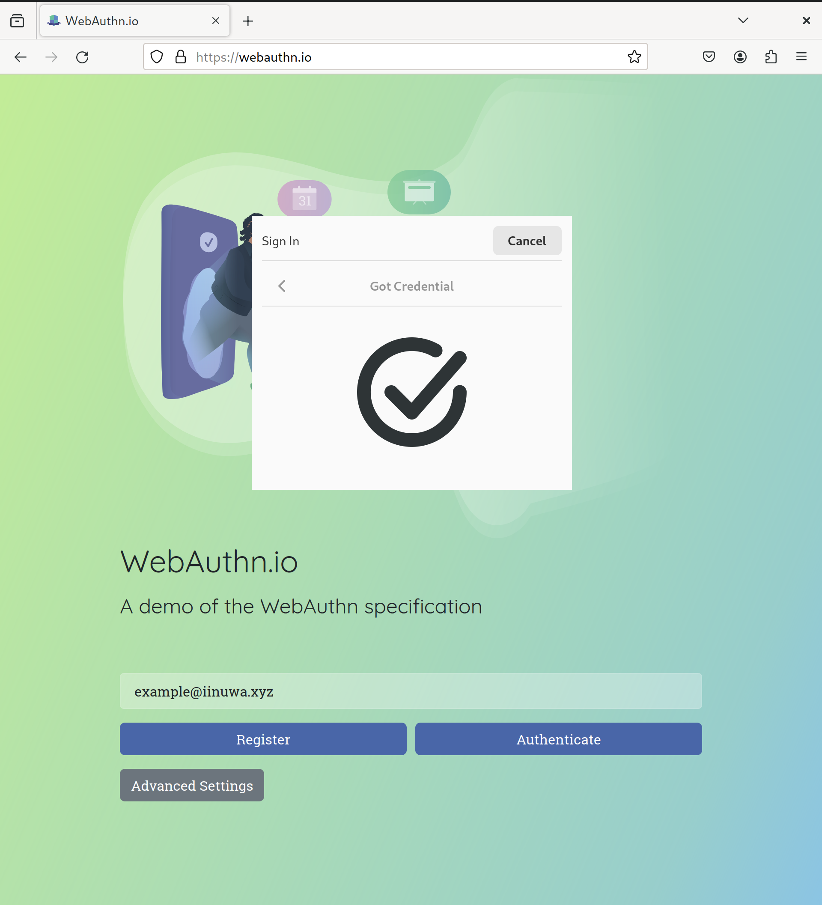
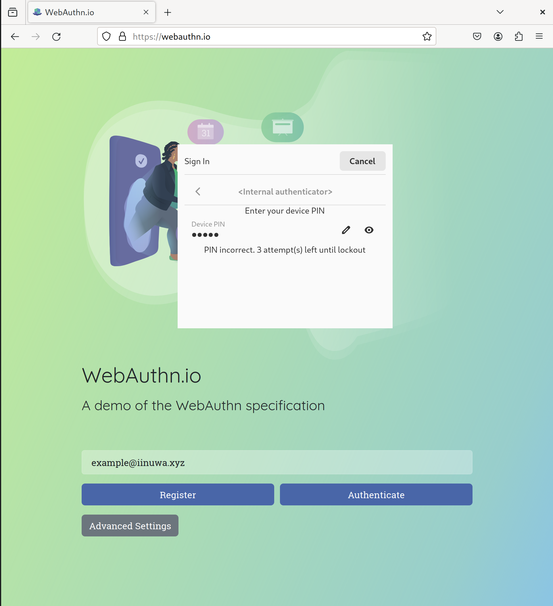
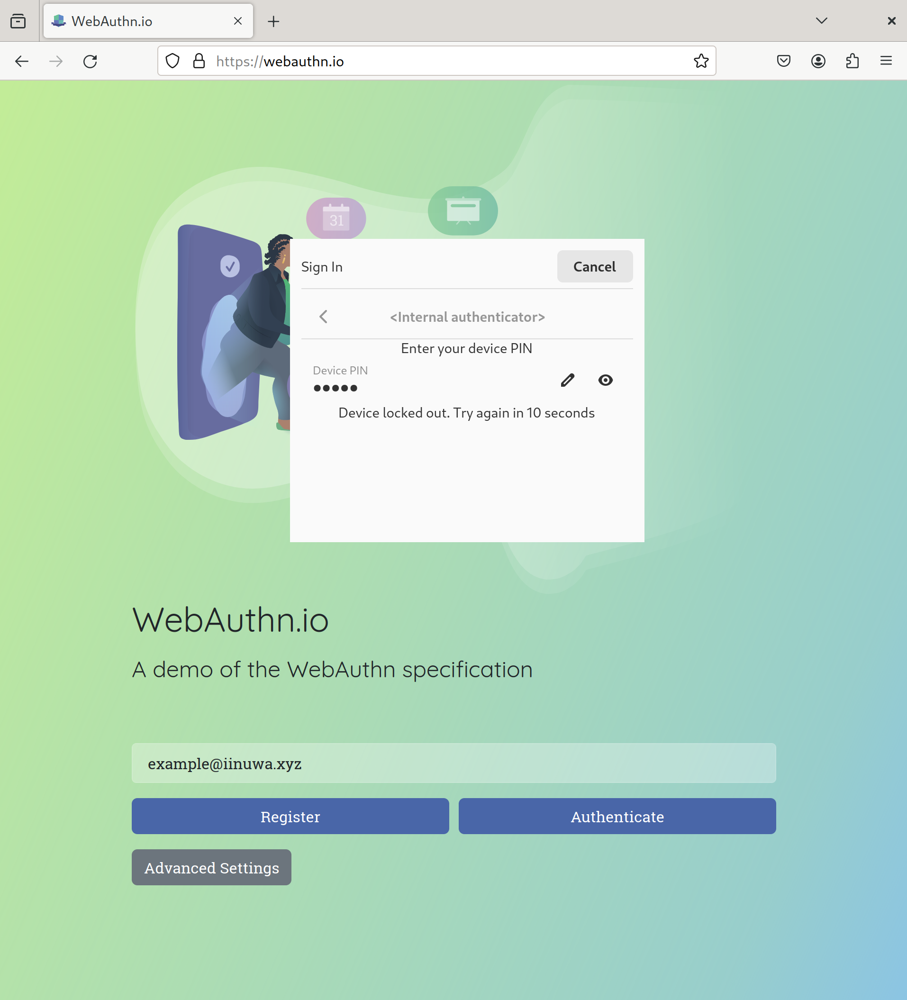
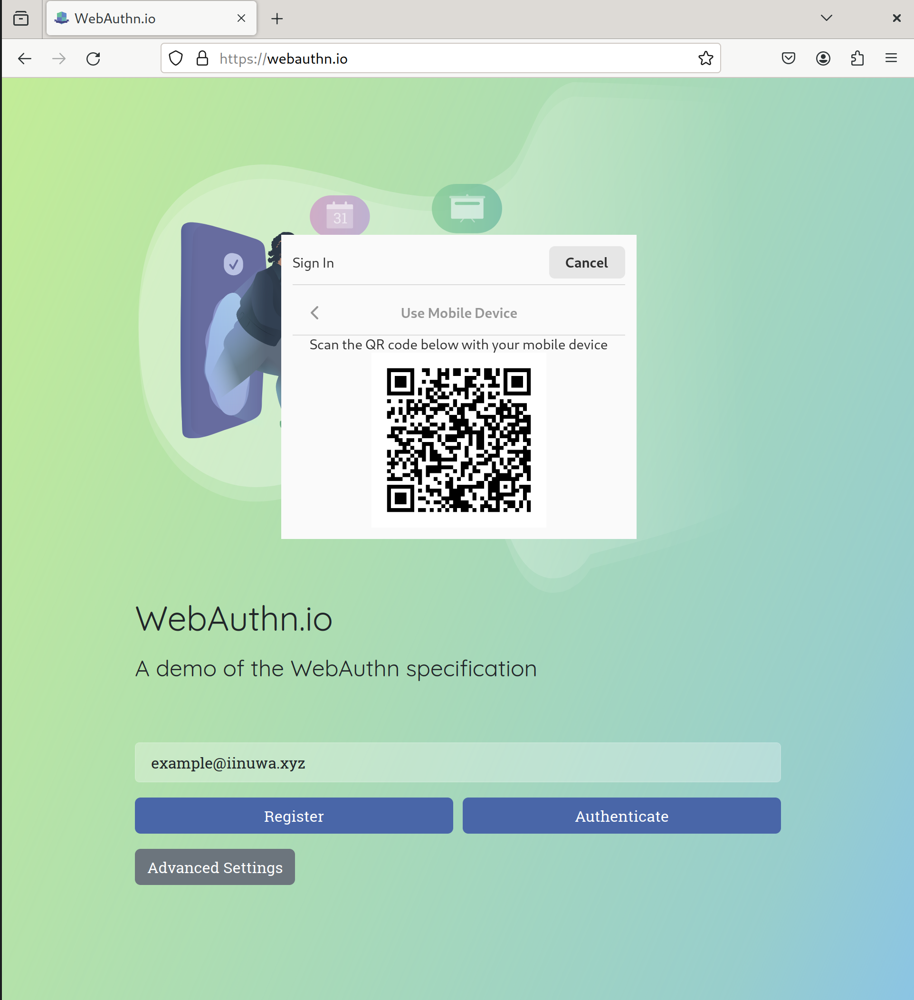
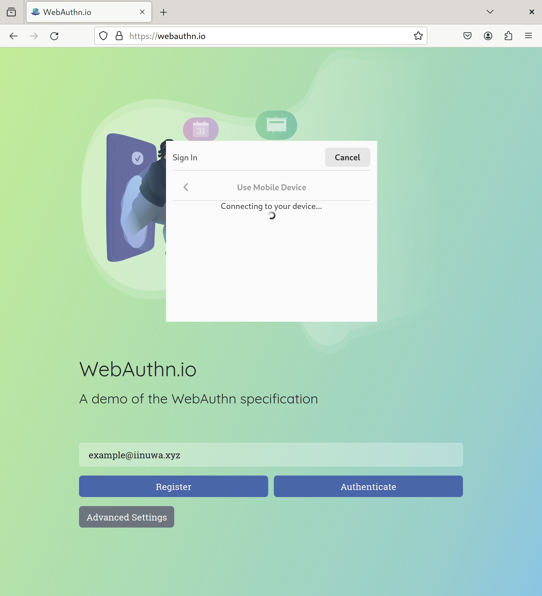
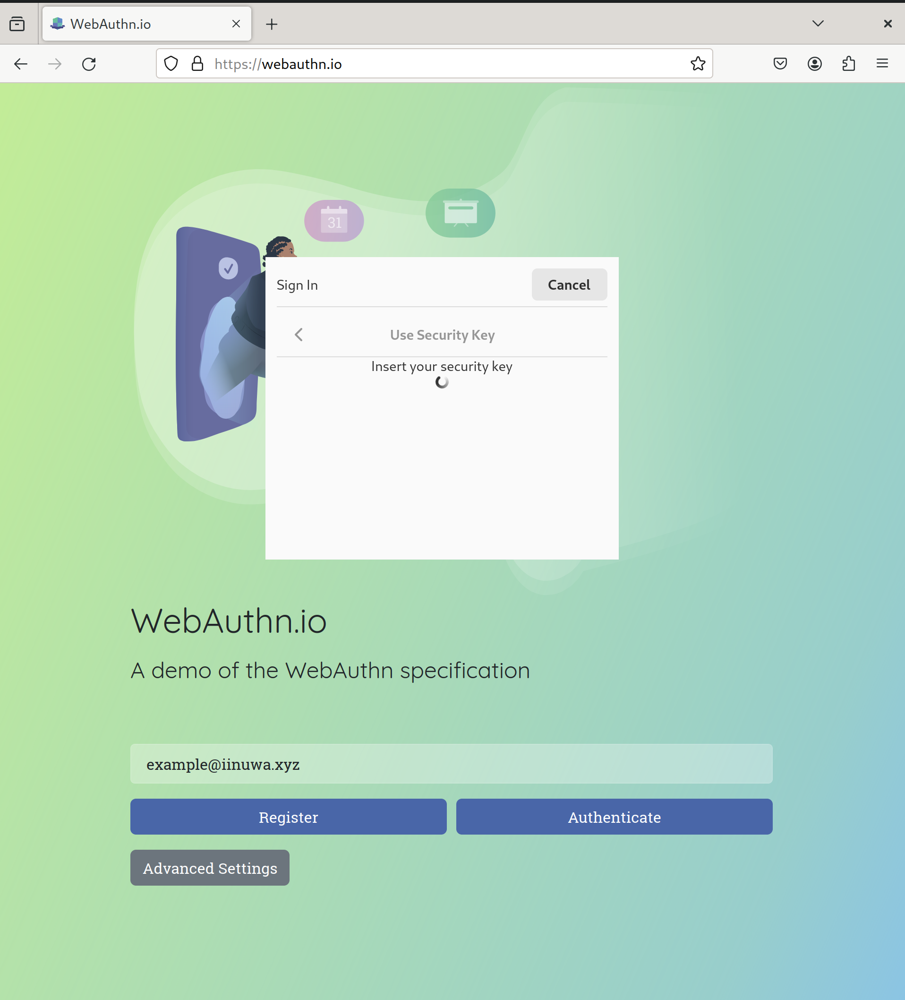
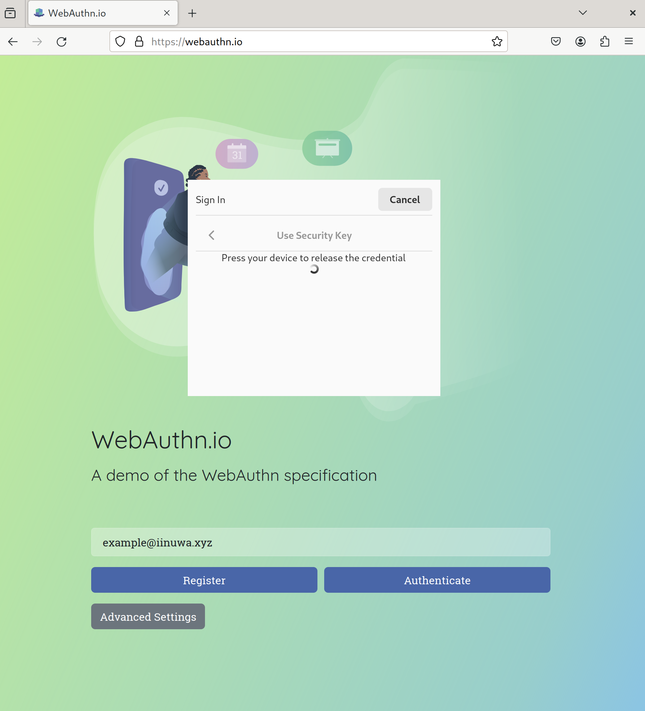

🚧 Excuse the mess, work in progress! 🚧

# Linux Credential Manager API

## Goals

The goal of this repository is to define a spec for clients (apps, browsers,
etc.) to retrieve user credentials in a uniform way across Linux desktop
environments.

Some high-level goals:

- define an API to securely create and retrieve local credentials
  (passwords, passkeys, security keys)
- create and retrieve credentials on remote devices (e.g. via CTAP 2 BLE/hybrid
  transports)
- Provide a uniform interface for third-party credential providers
  (password/passkey managers like GNOME Secrets, Bitwarden, Keepass, LastPass,
  etc.) to hook into

Some nice-to-haves:
- Design a specification for a platform authenticator. I'm not sure whether this
needs to be specified, or whether it could be considered and implemented as a
first-party credential provider.

Some non-goals:

- Fully implement the proposed specification. This repo is focused on defining
the D-Bus API for clients and portal frontend/backend implementations to use.
Though I would love to help implement, I don't think I will have the time to
fully implement the features specced by the API, so I welcome collaboration
from others to help implement. For now, any implementation in this repository
is for reference purposes.

- Create a full-featured password manager. Features like Password syncing,
password generation, rotation, etc. is not part of this specficiation. Other
password manager projects should be able to use this to make their credentials
available to the user uniformly, though.

- BSD support. While I'd love to help out all open desktop environments, I don't
know enough about any BSD to make it useful for them. Hopefully, the design
process is transparent enough that someone else could design something that
works for BSDs.

## Current Work

- May 2024: Met with developers in GNOME and systemd to design internals for
  securely storing device credentials.
- Jan 2024: I've defined the [scenarios](doc/scenarios.md) that I expect this
  API to cover. I am working on extracting [API methods](doc/api.md) required to
  implement the interactions between the client, portal frontend, portal backend,
  machine and mobile devices. Once that is done, I intend to convert the API into
  a [portal spec](doc/design-doc.md), making it fit normal D-Bus/portal patterns.

## Mockups

Here are some mockups of what this would look like for a user:

### Internal platform authenticator flow (device PIN)

Alternatively, lock out the credential based on incorrect attempts.

### Hybrid credential flow

### Security key flow

## Related projects:
- https://github.com/AlfioEmanueleFresta/xdg-credentials-portal
- authenticator-rs
- webauthn-rs
