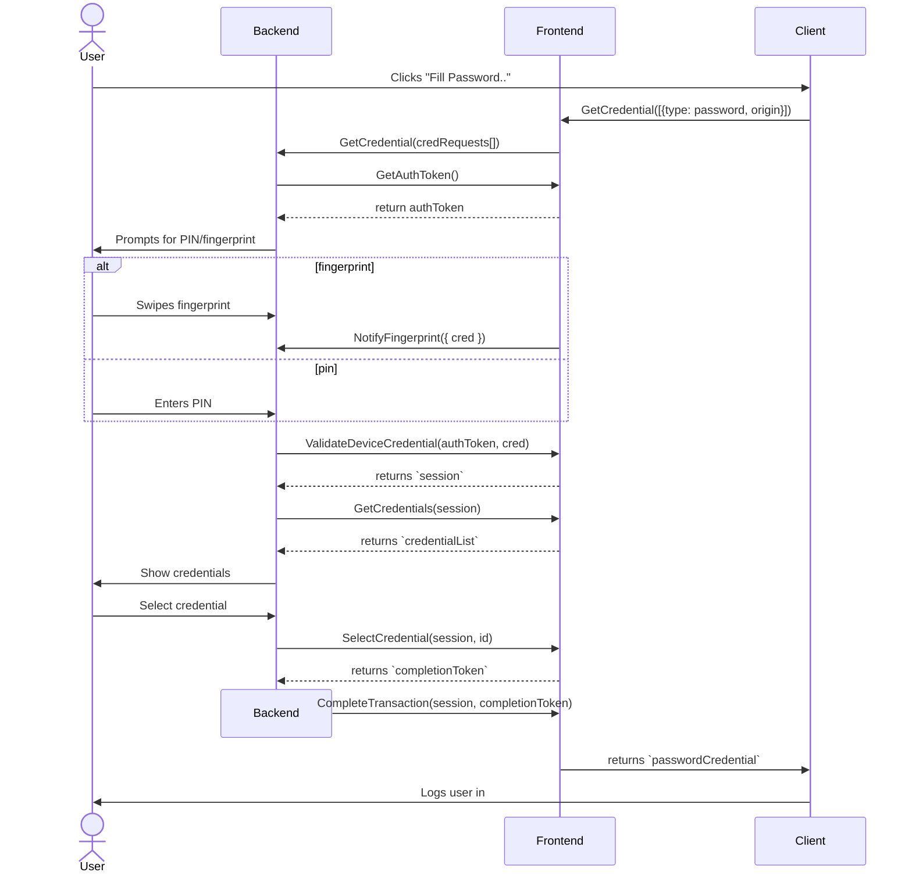
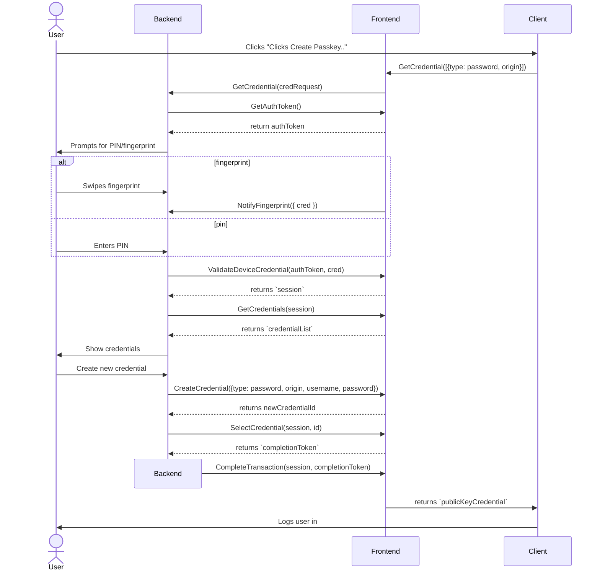
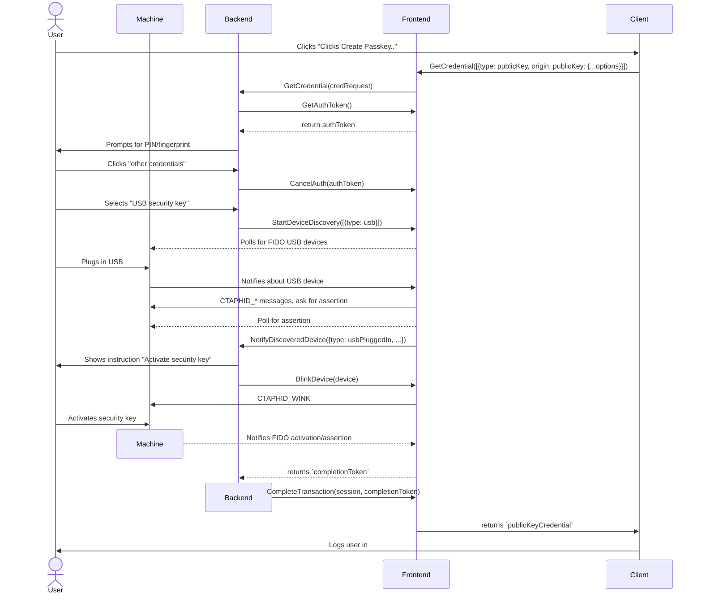
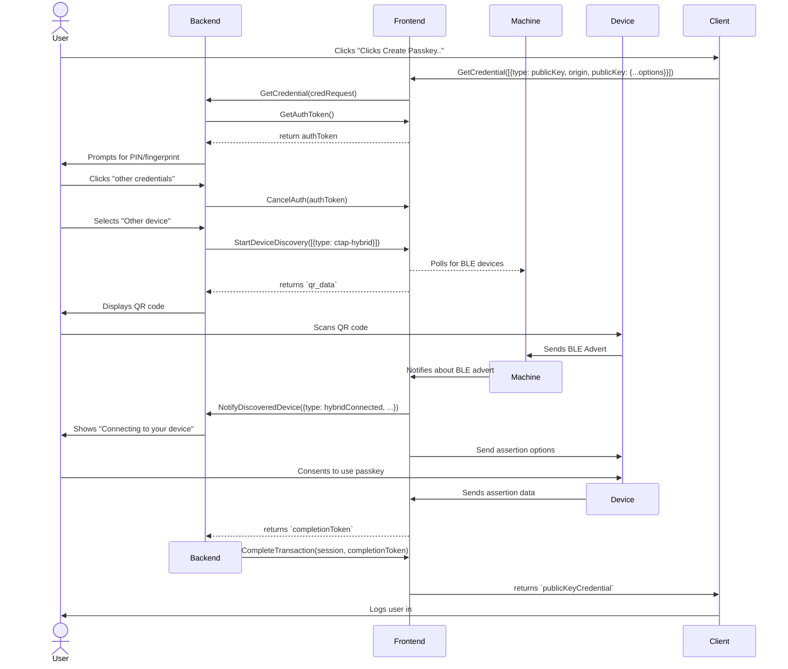
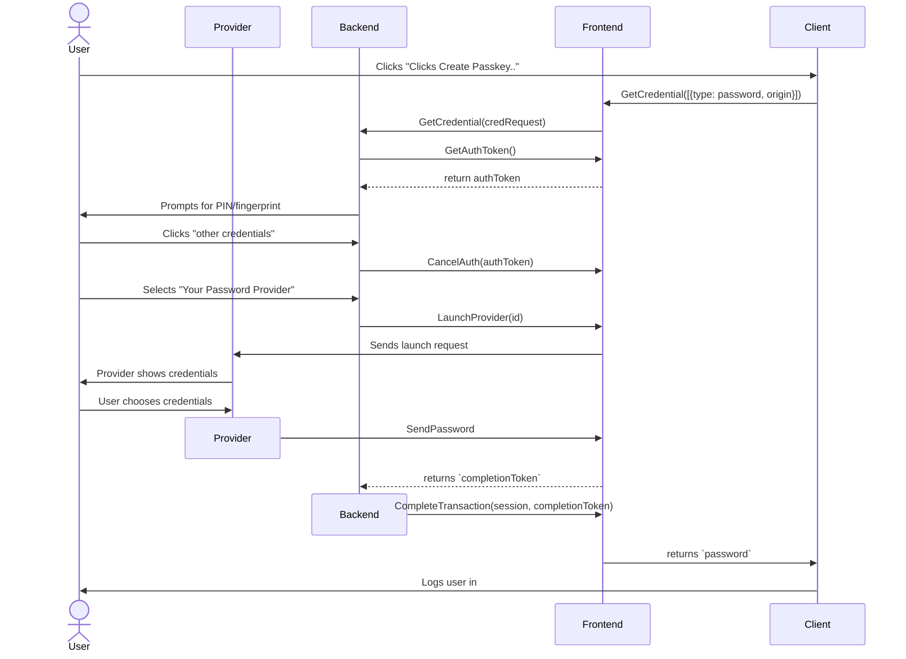
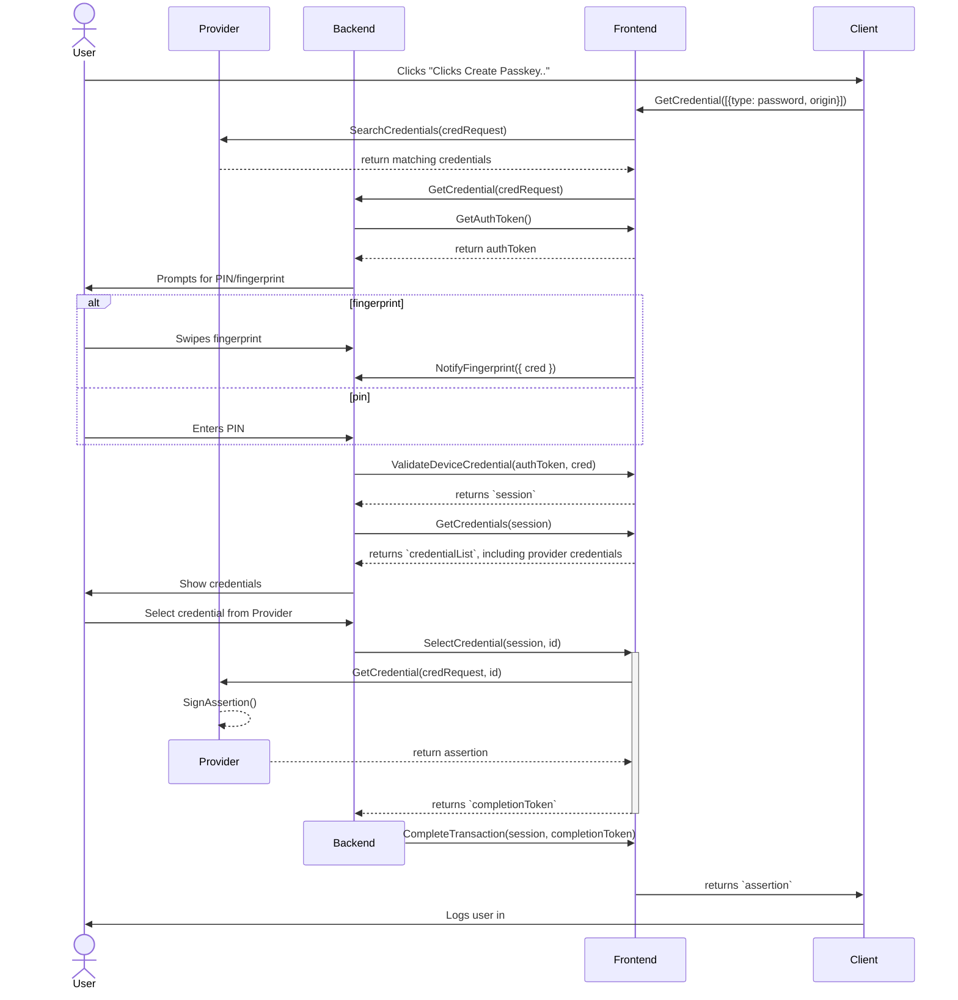

# Scenario 1: Password (Browser)

1. User opens a website with username and password field.
1. autofill is not enabled
1. user right-clicks to open menu on the username field, browser offers "fill password..." (click 1)
1. browser calls frontend "GetCredential" method, with "type: password" and origin specified
1. user is presented with UI: Do you want to sign into <origin> on <app>? enter fingerprint/device PIN to select credentials
1. user enters credentials. (interaction 2)
1. user is shown a list of credentials, ordered by most relevant based on the origin provided (interaction 3)
1.  user scrolls and selects the relevant credential
1. backend sends ID back to frontend, which pulls the corresponding credential and sends back to client
1. browser receives credentials, fills in username and password.



## Questions
- Can we send extra form fields (for sites that ask for other fields besides username and password)?


# Scenario 2: Passkey (Browser)
1. User opens a website with passkey.
1. autofill is not enabled
1. user clicks passkey button (interaction 1)
1. browser calls frontend "GetCredential" method, with "type: publicKey", origin, and assertion options specified
1. user is presented with UI: Do you want to sign into <origin> on <app>? enter fingerprint/device PIN to select credentials
1. user enters credentials. (interaction 2)
1. backend sends credentials to frontend to verify
1. user is shown a list of credentials, filtered by assertion options and ordered by most relevant based on the origin provided
    - invalid passkeys should not be shown? (because they won't work at all, and for phishing protection), but irrelevant passwords can be shown
    - This may cause issues for some origins if they're not registered properly.
    - Technically, it's the responsibilty of the RP to validate the origin. If the origin is wrong, that's part of the authenticator data, and the RP can reject it. So even if a third-party phisher initiated the assertion from another site, the attacker couldn't use the credentials, because the RP wouldn't recognize the origin. So it might be OK to allow other passkeys to sign the assertion.
1.  user scrolls and selects the relevant credential
1. backend sends ID back to frontend, which pulls the corresponding credential and sends back to client
1. browser receives credentials,

```
sequenceDiagram
    actor U as User
    participant B as Backend
    participant F as Frontend
    participant C as Client
    
    
    U->>C: Clicks "Clicks Create Passkey.."
    C->>F: GetCredential([{type: publicKey, origin, publicKey: {...options}}])
    F->>B: GetCredential(credRequest)
    B->>F: GetAuthToken()
    F-->>B: return authToken
    B->>U: Prompts for PIN/fingerprint
    alt fingerprint
        U->>B: Swipes fingerprint
        F->>B: NotifyFingerprint({ cred })
    else pin
        U->>B: Enters PIN
    end
    B->>F: ValidateDeviceCredential(authToken, cred)
    F-->>B: returns `session`
    B->>F: GetCredentials(session)
    F-->>B: returns `credentialList`
    B->>U: Show credentials
    U->>B: Select credential
    B->>F: SelectCredential(session, id)
    F->>F: SignAssertion()
    F-->>B: returns `completionToken`
    destroy B
    B->>F: CompleteTransaction(session, completionToken)
    F->>C: returns `publicKeyCredential`
    C->>U: Logs user in
```

# Scenario 3: Password, create-on-the-fly

1. User opens a website with username and password field.
1. autofill is not enabled
1. user right-clicks to open menu on the username field, browser offers "fill password..." (click 1)
1. browser calls frontend "GetCredential" method, with "type: password" and origin specified
1. user is presented with UI: Do you want to sign into <origin> on <app>? enter fingerprint/device PIN to select credentials
1. user enters credentials. (interaction 2)
1. Backend sends credentials to frontend to validate
    * this authentication must be tied to this session must be validated, and time-limtied
1. user is shown a list of credentials, ordered by most relevant based on the origin provided (interaction 3)
1.  user scrolls, doesn't find credential, select "create credential"
1. User types in username and password
1. Backend sends create credential to frontend with origin, receives ID back from 
1. backend sends ID back to frontend, which pulls the corresponding credential and sends back to client
1. browser receives credentials, fills in username and password.



# Scenario 4: Passkey, create-on-the-fly
- not supported by WebAuthn yet

# Scenario 5: Passkey, USB
1. User opens a website with username and password field.
1. autofill is not enabled
1. browser calls frontend "GetCredential" method, with "type: publicKey" and origin specified
1. User clicks passkey button (click 1)
1. user is presented with UI: Do you want to sign into <origin> on <app>? enter fingerprint/device PIN to select credentials. (Or "use a different device (e.g., USB or mobile device)")
1. user clicks on other options (click 2)
1. User clicks on USB (click 3 )
    * this could be done in a different order. If the frontend detects that a FIDO USB device has been connected, then it should signal the backend that it has seen that device. Then the frontend can show the USB device option immediately.
1. Backend shows instructions while waiting for USB
1. User plugs in USB (interaction 4)
1. frontend signals backend that USB was plugged in
1. backend shows instructions to press button
1. user pushes button (interaction 5)
1. frontend signals backend that USB was pressed and sends ref to assertion
1. Backend completes assertion by sending ref back to frontend and closes the window
1. frontend receives assertion ref
1. frontend sends webauthn result to client


# Scenario 6: Passkey, hybrid
1. User opens a website with username and password field.
1. autofill is not enabled
1. browser calls frontend "GetCredential" method, with "type: publicKey" and origin specified
1. User clicks passkey button (click 1)
1. user is presented with UI: Do you want to sign into <origin> on <app>? enter fingerprint/device PIN to select credentials. (Or "use a different device (e.g., USB or mobile device)")
1. user clicks on other options (click 2)
1. Backend shows known mobile devices for state-assisted transactions 
1. User clicks on a different mobile device (click 3)
1. Backend notifies frontend about hybrid-transport-start
    1. frontend generates QR code data, begins BLE scan
    1. sends back QR code data
1. User scans QR code in USB (interaction 3)
1. User selects "yes, sign in" (interaction 4)
1. Mobile device begins BLE advert
1. Frontend detects BLE advert, signals backend
1. Backend shows that phone has been detected and shows "connecting to your device"
1. Frontend connects to caBLE server, gets assertion from device
1. Frontend 
1. frontend signals backend that assertion was received, sends completion handle
1. Backend tells user that the transaction is done, sends handle back to the Frontend
1. frontend receives assertion ref
1. frontend sends webauthn result to client


# Scenario 7: Password, delegate to provider
1. User opens a website with username and password field.
1. autofill is not enabled
1. User clicks passkey button (click 1)
1. browser calls frontend "GetCredential" method, with "type: password" and origin specified
1. user is presented with UI: Do you want to sign into <origin> on <app>? enter fingerprint/device PIN to select credentials. (Or "use a different device (e.g., USB or mobile device)")
    - The frontend has to tell the backend about available providers at some point
1. user clicks on other options (click 2)
1. Backend shows known mobile devices for state-assisted transactions 
1. User clicks on a different provider (click 3)
1. Backend shows "waiting on credentials from {provider}",
1. Backend signals frontend about provider request
1. Frontend notifies provider about credential request
1. Provider shows UI to select credential
1. User selects credential (click 4+)
1. Provider sends password/assertion data to frontend
1. frontend sends assertion notification to backend with completion handle
1. frontend signals backend that assertion was received, sends completion handle
1. Backend tells user that the transaction is done, sends handle back to the Frontend
1. frontend receives assertion ref
1. frontend sends webauthn result to client


# Scenario 8: Passkey or public key, delegate to provider, without extra provider UI
1. User opens a website with username and password field.
1. autofill is not enabled
1. User clicks passkey button (click 1)
1. browser calls frontend "GetCredential" method, with "type: publicKey" and origin specified
1. Frontend calls providers to fill credentials, within timeout period
1. Provider A sends matching credentials to Frontend
1. user is presented with UI: Do you want to sign into <origin> on <app>? enter fingerprint/device PIN to select credentials. (Or "use a different device (e.g., USB or mobile device)")
    - The frontend has to tell the backend about available providers at some point
1. user puts in device credentials (interaction 2)
1. Backend shows known credentials, including ones from providers that sent in creds on time
1. User selects provider credential (click 4+)
1. Backend tells frontend about selection
1. Frontend tells provider about selection
1. Provider sends credential data to Frontend
1. frontend sends assertion notification to backend with completion handle
1. frontend signals backend that assertion was received, sends completion handle
1. Backend tells user that the transaction is done, sends handle back to the Frontend
1. frontend receives assertion ref
1. frontend sends webauthn result to client
