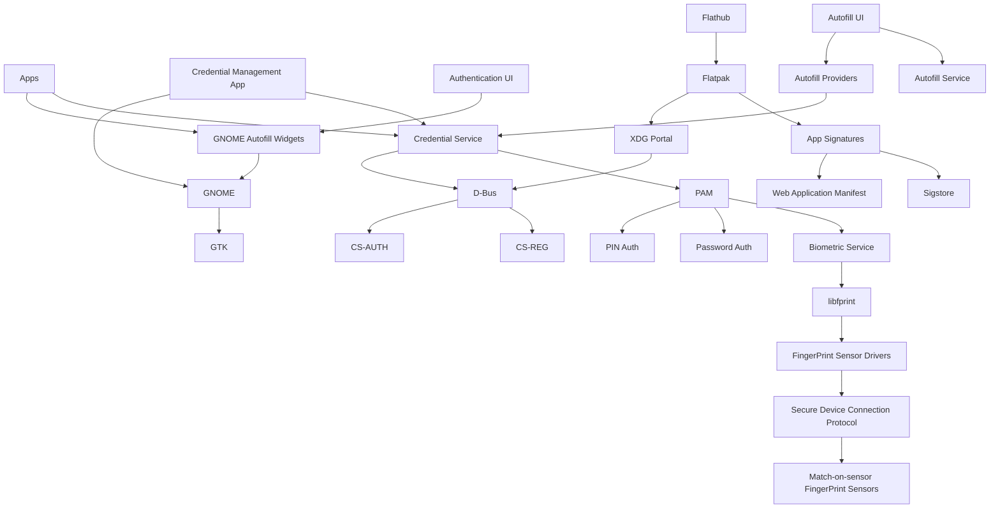

```mermaid
graph
  Apps;
  CS[Credential Service];
  CMA[Credential Management App];

  AuthUI[Authentication UI];

  AFS[Autofill Service];
  AFP[Autofill Providers];
  AFUI[Autofill UI];

  FPD[FingerPrint Sensor Drivers]
  SDCP[Secure Device Connection Protocol];
  FPS[Match-on-sensor FingerPrint Sensors];
  BIO[Biometric Service];
  PAM;
  GNOME-AFW[GNOME Autofill Widgets];

  PWAuth[Password Auth]
  PinAuth[PIN Auth]
  Flatpak;
  Flathub;
  SIGN[App Signatures];
  Sigstore;
  WAF[Web Application Manifest];

  XDGP[XDG Portal];
  DBUS[D-Bus];


  Apps-->CS;
  Apps-->GNOME-AFW;
  CMA-->CS;
  CMA-->GNOME;

  AuthUI-->GNOME-AFW;
  GNOME-AFW-->GNOME;
  GNOME-->GTK;
  AFUI-->AFS;
  AFUI-->AFP;

  AFP-->CS;

  CS-->PAM;
  PAM-->BIO;
  BIO-->libfprint;
  libfprint-->FPD;
  FPD-->SDCP;
  SDCP-->FPS;

  PAM-->PWAuth;
  PAM-->PinAuth;

  Flathub -->Flatpak;
  Flatpak-->SIGN;
  SIGN-->Sigstore;
  SIGN-->WAF;
  Flatpak-->XDGP;
  XDGP-->DBUS;
  DBUS-->CS-REG;
  DBUS-->CS-AUTH;
  CS-->DBUS;
```
